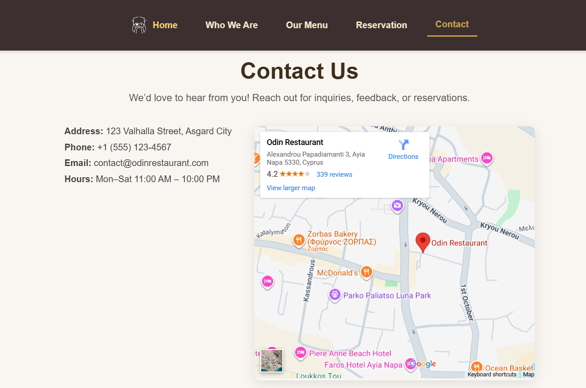

# Odin Restaurant Website




## Overview

Odin Restaurant is a modern, responsive website showcasing a Nordic-inspired restaurant. The project demonstrates dynamic content generation with **JavaScript modules** and **Webpack** for bundling, while maintaining a clean, consistent design with CSS.

## Features

* **Dynamic Tab Navigation:** Content is loaded dynamically using JS modules when navigating between Home, Menu, Who We Are, Reservation, and Contact sections.
* **Responsive Design:** Works across desktops, tablets, and mobile devices.
* **CSS Transitions:** Smooth fade-in animation when switching tabs.
* **Webpack Setup:** Bundles JS modules and CSS into a single production-ready output.
* **Clean Layout:** Fixed header ensures consistent navigation while scrolling.

## How It Works

1. **Modular Structure:**
   Each section (Home, Menu, Who We Are, Reservation, Contact) is created in its own JavaScript module. Each module exports a function that builds the section’s content and returns a container element.

2. **Dynamic Rendering:**
   The main `index.js` imports all modules. When a navigation button is clicked:

   * The current content in `#content` is cleared.
   * The selected module is invoked to generate the new section.
   * The new section is appended to `#content`.

## Project Structure

```
odin-restaurant/
├── dist/                  # Compiled build files
├── node_modules/          # Node dependencies
├── src/
│   ├── assets/            # Images and static assets
│   ├── index.js           # Main JS entry
│   ├── styles.css         # Main stylesheet
│   ├── template.html      # Base HTML
│   └── modules/           # JS modules for each section
│       ├── home.js
│       ├── menu.js
│       ├── whoWeAre.js
│       ├── reservation.js
│       └── contact.js
├── package.json
├── webpack.config.js
└── README.md
```

## Installation

1. Clone the repository:

```bash
git clone https://github.com/EmreKaplan67/odin-restaurant-webpack.git
```

2. Install dependencies:

```bash
npm install
```

2. Start a local server to serve the project:

```bash 
npm run serve
```

## Usage

* Click the navigation buttons to switch between sections.
* The **Menu** displays dishes dynamically with images and prices.
* The **Reservation** form allows users to select a date and time (frontend only).
* The **Contact** section shows restaurant details and a placeholder for the map.

## Technologies Used

* **HTML5 & CSS3** for structure and styling
* **JavaScript (ES6 Modules)** for dynamic content
* **Webpack** for module bundling and asset management
* **Node.js & npm** for package management

## License

This project is for **educational purposes** as part of a Odin Project course.

